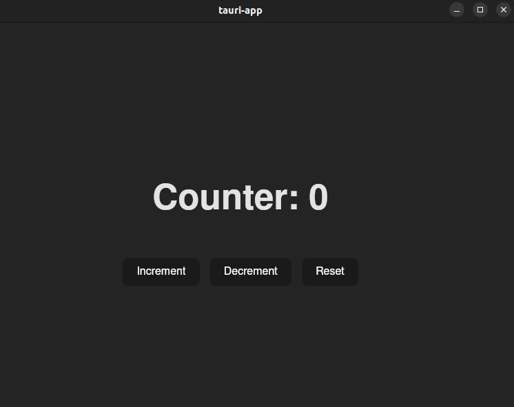

# Tauri App

This is a simple Counter App built using React, Vite, and Tauri. The app provides a desktop interface that allows users to increment, decrement, and reset a counter, with all the logic being managed in a backend implemented using Tauri(Rust). The app is packaged as a native desktop application using Tauri, making it lightweight and easy to distribute across different platforms.

## Tech Stack

- **Front-End**

  - React
  - Vite

- **Backend**
  - Rust
- **FrameWork**

  - Tauri

## Prerequisites

- Node.js
- Rust

## Quick Start

1.Clone and Setup

```
git clone <repository-url>
cd tauri-app
```

2.Commands

```
npm install
npm run dev
sudo apt update
sudo apt install libwebkit2gtk-4.1-dev \
  build-essential \
  curl \
  wget \
  file \
  libxdo-dev \
  libssl-dev \
  libayatana-appindicator3-dev \
  librsvg2-dev

  curl --proto '=https' --tlsv1.2 https://sh.rustup.rs -sSf | sh

  npm install @tauri-apps/api

  npm run tauri dev
```

3.UI

Here's an image from my project

